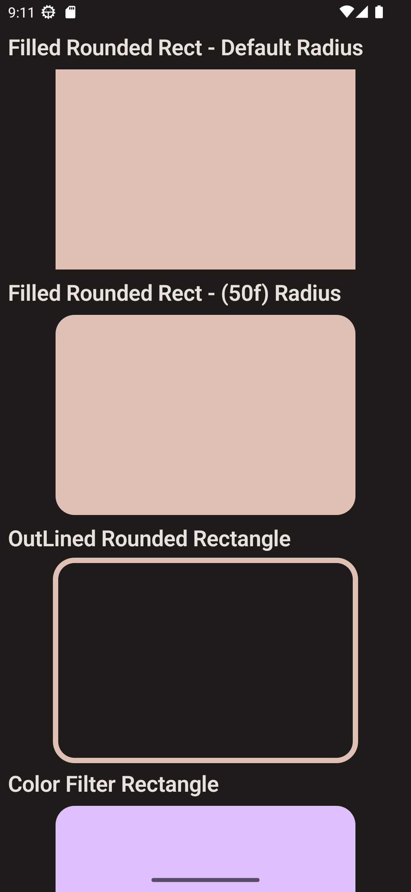

# Canvas In Compose
A sample app made to demonstrate usage of canvas in jetpack compose.
read more about it in my [blog](https://blog.realogs.in/graphics-in-jetpack-compose/).

# Blog Assets
Check out the assets used in the blog [**FIGMA**](https://www.figma.com/file/H3i7icx5Wm4gfi7s7WWWe5/Graphics-in-Compose-Blog?type=design&node-id=0%3A1&mode=design&t=MPSJkPi2eJWyIr9A-1)

app logo credits to [Yogi Aprelliyanto](https://thenounproject.com/icon/canvas-5463213/)

# Things Covered
- [Draw Arc](./app/src/main/java/xyz/jayeshseth/canvasexample/canvas/Draw%20Arc.kt)
- [Draw Circle](./app/src/main/java/xyz/jayeshseth/canvasexample/canvas/Draw%20Circle.kt)
- [Draw Line](./app/src/main/java/xyz/jayeshseth/canvasexample/canvas/Draw%20Line.kt)
- [Draw Oval](./app/src/main/java/xyz/jayeshseth/canvasexample/canvas/Draw%20Oval.kt)
- [Draw Path](./app/src/main/java/xyz/jayeshseth/canvasexample/canvas/Draw%20Path.kt)
- [Draw Points](./app/src/main/java/xyz/jayeshseth/canvasexample/canvas/Draw%20Points.kt)
- [Draw Rect](./app/src/main/java/xyz/jayeshseth/canvasexample/canvas/Draw%20Rect.kt)
- [Draw Rounded Rect](./app/src/main/java/xyz/jayeshseth/canvasexample/canvas/Draw%20Rounded%20Rect.kt)

# Screenshots
## Draw Arc
|               1                |                2                |
|:------------------------------:|:-------------------------------:|
|  |  |

[Learn More](https://blog.realogs.in/graphics-in-jetpack-compose/#draw-arc)

## Draw Circle
|                 1                 |                 2                  |
|:---------------------------------:|:----------------------------------:|
|  |  |

[Learn More](https://blog.realogs.in/graphics-in-jetpack-compose/#draw-circle)

## Draw Line
|                1                |                2                 |
|:-------------------------------:|:--------------------------------:|
|  |  |

[Learn More](https://blog.realogs.in/graphics-in-jetpack-compose/#draw-line)

## Draw Oval
|                1                |                2                 |
|:-------------------------------:|:--------------------------------:|
|  |  |

[Learn More](https://blog.realogs.in/graphics-in-jetpack-compose/#draw-circle)

## Draw Path
|                1                |
|:-------------------------------:|
|  |

[Learn More](https://blog.realogs.in/graphics-in-jetpack-compose/#draw-path-draw-point)

## Draw Points
|                 1                 |                 2                  |
|:---------------------------------:|:----------------------------------:|
|  |  |

[Learn More](https://blog.realogs.in/graphics-in-jetpack-compose/#draw-path-draw-point)

## Draw Rect
|                1                |                2                 |
|:-------------------------------:|:--------------------------------:|
|  |  |

[Learn More](https://blog.realogs.in/graphics-in-jetpack-compose/#draw-rect)

## Draw Rounded Rect
|                   1                    |                    2                    |
|:--------------------------------------:|:---------------------------------------:|
|  |  |

[Learn More](https://blog.realogs.in/graphics-in-jetpack-compose/#draw-rect)
